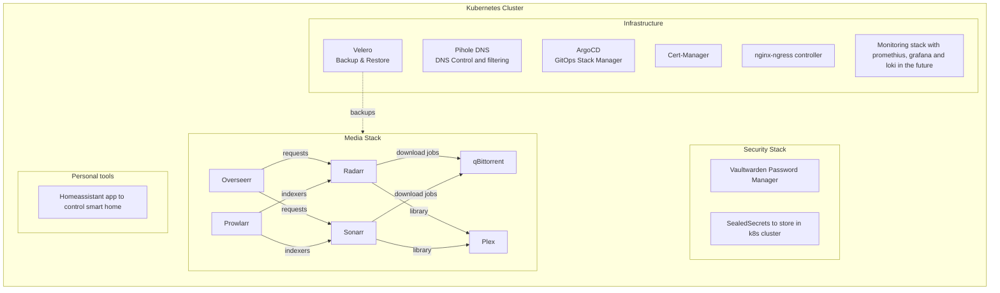

# Homelab Kubernetes Project

---

### Architecture (high level)

---

This repository contains my personal homelab setup, with a focus on **Kubernetes-based infrastructure**, **GitOps-friendly configuration**, and **self-hosted media / productivity services**. The goal of this project is to practice real-world infrastructure patterns and showcase my experience with container orchestration, automation, and operational best practices.

This `README` is a **work in progress** and will be updated as the project evolves and additional components are added or refined.

### High-Level Overview

- **Infrastructure**: Kubernetes-based homelab, managed via declarative configuration (e.g. Helm charts and `values.yaml` files).
- **Backup & Recovery**: Velero configuration (see `infrastructure/velero/`) for cluster-level and persistent volume backups.
- **Media Stack**: Self-hosted media applications (e.g. Plex, Radarr, Sonarr, qBittorrent, Overseerr, Prowlarr) managed via Helm values under `apps/media/`.
- **Security & Secrets**: Sensitive configuration handled via sealed manifests (e.g. `vaultwarden-admin.sealed.yaml`) and `.gitignore` rules to keep secrets out of source control.

As this environment grows, I will expand this document with architecture diagrams, deployment workflows, and more detailed service descriptions.

### Technologies & Tools

- **Kubernetes** (homelab cluster)
- **Helm** (chart and values-based configuration)
- **Velero** (backup and disaster recovery)
- **Self-Hosted Media Apps** (Plex, Radarr, Sonarr, qBittorrent, Overseerr, Prowlarr, etc.)
- **Linux (WSL2)** as the primary development environment

### What This Project Demonstrates

- **Infrastructure as Code**: Clustering, apps, and backups are defined declaratively and can be reproduced.
- **Operational Thinking**: Includes backup, restore, and data-protection concerns (Velero, persistent storage).
- **Realistic Homelab Use Case**: Media stack and supporting services configured similarly to a production-like environment, but in a personal lab context.

In future iterations, this `README` will include:

- A more detailed **architecture overview** (networking, storage, and security layers).
- **How to deploy** this stack from scratch.
- Notes on **trade-offs and design decisions** made along the way.

