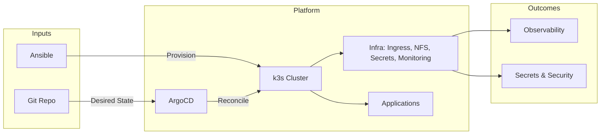
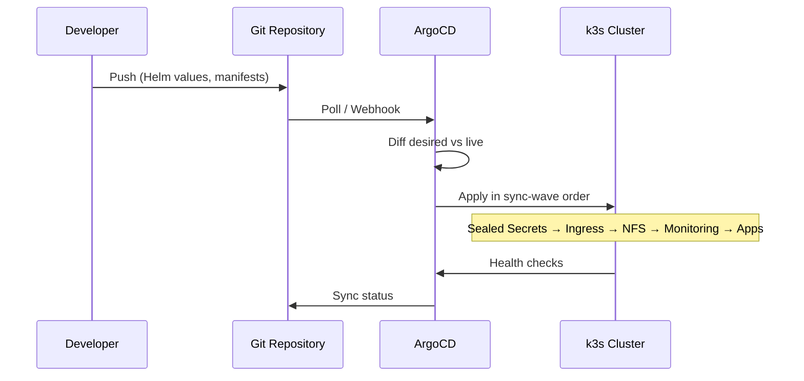
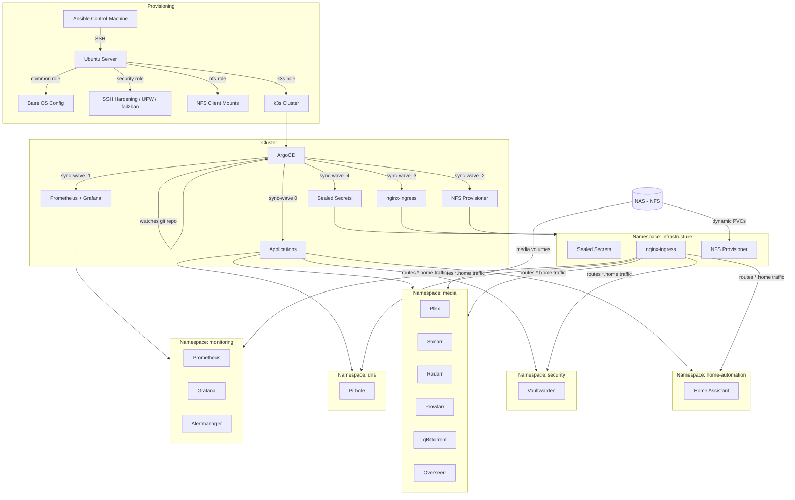

# Production-Grade Kubernetes Platform · GitOps & IaC


**A single-node k3s platform—provisioned from bare metal with Ansible, operated entirely via GitOps (ArgoCD), with declarative Helm charts, sync-wave orchestration, sealed secrets, and full observability.** This repository demonstrates platform engineering and SRE practices: infrastructure as code, desired-state reconciliation, secure secret management, and migration from Docker Compose to Kubernetes.

---

## At a glance (high level)

One sentence: **bare metal → Ansible → k3s → ArgoCD → everything from git, with observability and secrets handled properly.**

| Area | What’s in this repo |
|------|---------------------|
| **Platform / GitOps** | App-of-apps pattern, custom Helm charts, sync-wave ordering, NFS-backed storage, ingress and TLS. |
| **Observability** | Prometheus, Grafana, Alertmanager; Velero for backup/restore. |
| **Security** | Sealed Secrets, SSH hardening, UFW, fail2ban, non-root containers, RBAC. |
| **IaC** | Ansible roles (OS, security, NFS, k3s). No manual `kubectl apply`—cluster state is declarative and git-controlled. |
| **Migration** | Docker Compose → k3s path; backup/restore tooling; Makefile and scripts for demo and bootstrap. |

**For technical depth:** architecture, sync waves, storage, and security are documented below and in `docs/architecture.md`, `docs/setup.md`.

---

## High-Level Platform View



---

## GitOps Reconciliation Flow

All changes are driven by **git**. ArgoCD continuously reconciles the cluster to the desired state; manual edits are reverted by self-heal.



---

## Architecture (Provisioning → Cluster → Workloads)



---

## Tech Stack

| Category | Tool | Purpose |
|----------|------|---------|
| **Orchestration** | k3s | Lightweight Kubernetes (single node) |
| **GitOps** | ArgoCD | Declarative sync from git; app-of-apps |
| **Packaging** | Helm | Custom charts for every app and infra component |
| **Provisioning** | Ansible | Bare-metal → OS, security, NFS, k3s |
| **Secrets** | Sealed Secrets | Encrypt secrets for safe storage in git |
| **Ingress** | nginx-ingress | TLS, routing, security headers |
| **Storage** | NFS Subdir Provisioner | Dynamic PVCs on NAS |
| **Observability** | Prometheus, Grafana, Alertmanager | Metrics, dashboards, alerting |
| **Backup** | Velero | Cluster backup/restore (optional) |

Application stack: Pi-hole, Plex, Sonarr, Radarr, Prowlarr, qBittorrent, Overseerr, Home Assistant, Vaultwarden—each as a custom Helm chart with PVCs, ingress, and (where needed) Sealed Secrets.

---

## Repository Structure

```
homelab/
├── ansible/                    # IaC: bare metal → k3s
│   ├── inventory/              # hosts, group_vars
│   ├── playbooks/              # site.yml, k3s.yml, setup.yml, maintenance.yml
│   └── roles/                  # common, security, nfs, k3s, maintenance
├── infrastructure/             # Helm charts for cluster-wide services
│   ├── argocd/
│   ├── cert-manager/
│   ├── monitoring/             # kube-prometheus-stack
│   ├── nfs-provisioner/
│   ├── nginx-ingress/
│   ├── sealed-secrets/
│   └── velero/
├── apps/                       # Custom Helm charts per application
│   ├── dns/pihole/
│   ├── media/                  # plex, sonarr, radarr, prowlarr, qbittorrent, overseerr
│   ├── home-automation/homeassistant/
│   └── security/vaultwarden/
├── argocd-apps/                # ArgoCD Application CRs (app-of-apps)
│   ├── app-of-apps.yaml
│   ├── infrastructure/         # sync-wave ordered
│   └── apps/
├── scripts/                    # bootstrap.sh, seal-secret.sh, setup_secrets.sh
├── tools/                      # config_migrator, migration_manager (Docker → k8s)
└── docs/                       # architecture.md, setup.md
```

---

## Security Highlights

- **Sealed Secrets** — Secrets encrypted with cluster public key; only the in-cluster controller can decrypt.
- **Host hardening** — Ansible: SSH key-only, no root login, UFW default-deny, fail2ban.
- **Workloads** — Non-root where possible; read-only root filesystem (e.g. Vaultwarden); minimal capabilities (e.g. Pi-hole only for DNS).
- **Ingress** — HSTS, hidden server tokens, strict referrer policy; no secrets in git.

---

## Quick Start

**Prerequisites:** Ubuntu 22.04+ server, NAS with NFS, control machine with Ansible and `kubectl`.

1. Clone repo, copy `ansible/inventory/hosts.yml.example` → `hosts.yml`, set host and SSH.
2. Set NFS and any group vars in `ansible/inventory/group_vars/all.yml`.
3. Run **Ansible**: `ansible-playbook ansible/playbooks/site.yml` (provisions OS, security, NFS, k3s).
4. Copy kubeconfig from server, then run **bootstrap**: `./scripts/bootstrap.sh` (Sealed Secrets + ArgoCD + app-of-apps).
5. Create sealed secrets for apps that need them; ArgoCD syncs the rest from git.

Detailed steps: see `docs/setup.md`.

---

## Migration & Demo (Docker Compose → k3s)

The repo supports a **migration demo**: run a legacy Docker Compose stack and a k3d target cluster locally.

| Command | Description |
|---------|--------------|
| `make legacy-start` | Start legacy Docker Compose stack |
| `make demo-start` | Start k3d cluster (target k3s) |
| `make bootstrap` | Install ArgoCD and apply app-of-apps |
| `make clean` | Tear down legacy + k3d |

Separate **migrate-to-k3s** tooling (in parent repo) backs up Compose config and volumes, then restores into k3s PVCs via `kubectl exec` and a restore map.

---

## Services (Post-Deploy)

| Service | Namespace | Purpose |
|---------|-----------|---------|
| ArgoCD | `argocd` | GitOps UI and sync |
| Grafana | `monitoring` | Dashboards |
| Pi-hole | `dns` | DNS / ad blocking |
| Plex, Sonarr, Radarr, Prowlarr, qBittorrent, Overseerr | `media` | Media stack |
| Home Assistant | `home-automation` | IoT / automation |
| Vaultwarden | `security` | Password manager |

Ingress hostnames follow `*.home` (e.g. `grafana.home`, `sonarr.home`). See `docs/architecture.md` for ports and storage layout.

---

## License

[MIT](LICENSE)
