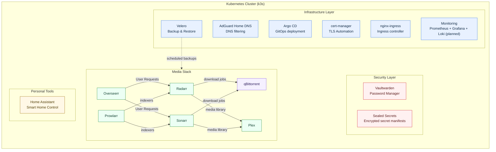

# Homelab Kubernetes Project

---

### Architecture (High-Level)

---

This repository contains a Kubernetes-based homelab managed with GitOps principles. It focuses on reliable operations, clear service boundaries, and reproducible application deployment using Helm and Argo CD.

### Project Scope

- **Platform**: k3s cluster with ingress, certificate management, and DNS filtering.
- **Media Stack**: Plex, Sonarr, Radarr, qBittorrent, Overseerr, and Prowlarr.
- **Security**: Sealed Secrets and self-hosted services such as Vaultwarden.
- **Operations**: Backup and recovery workflows using Velero.

### Recent Improvements

- **In-cluster service communication**: Sonarr and Radarr connect to qBittorrent via Kubernetes Service DNS (`qbittorrent-web.media.svc:8080`) rather than ingress hosts.
- **Shared storage consistency**: qBittorrent, Sonarr, and Radarr use the same NFS-backed mount path (`/mnt/nas`) to avoid path mapping/import issues.
- **Structured GitOps layout**: Applications are defined through Argo CD app manifests in `argocd-apps/apps/` and Helm charts under `apps/`.
- **Clear traffic separation**: Ingress hosts (`*.home`) are used for user access; internal Services are used for pod-to-pod communication.

### Technologies & Tools

- **Kubernetes** (homelab cluster)
- **Helm** (chart and values-based configuration)
- **Velero** (backup and disaster recovery)
- **Self-Hosted Media Apps** (Plex, Radarr, Sonarr, qBittorrent, Overseerr, Prowlarr, etc.)
- **Linux (WSL2)** as the primary development environment

### What This Project Demonstrates

- **Infrastructure as Code**: Clustering, apps, and backups are defined declaratively and can be reproduced.
- **Operational Thinking**: Includes backup, restore, and data-protection concerns (Velero, persistent storage).
- **Realistic Homelab Use Case**: Media stack and supporting services configured similarly to a production-like environment, but in a personal lab context.
