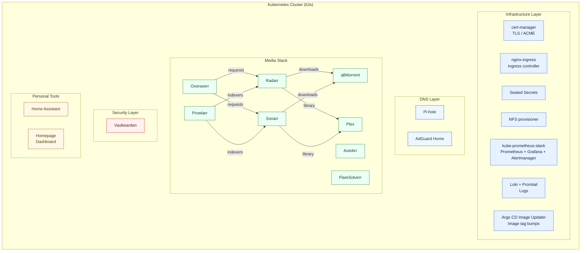

# Homelab Kubernetes Project

---

### Architecture (High-Level)

---

This repository contains a Kubernetes-based homelab managed with GitOps (Argo CD). Services are defined as Helm charts and Application CRs so the cluster stays reproducible from `main`.

### Project Scope

- **Platform**: k3s, nginx ingress, cert-manager (ACME-ready), Sealed Secrets, NFS-backed storage.
- **Observability**: Prometheus, Grafana, Alertmanager, node metrics, **Loki**, and **Promtail** (logs in Grafana).
- **DNS**: **Pi-hole** (network DNS / ad-blocking) and **AdGuard Home** (optional alternate UI/filtering stack).
- **Media**: Plex, Sonarr, Radarr, qBittorrent, Overseerr, Prowlarr, **Autobrr**, **FlareSolverr**.
- **Security**: Vaultwarden (passwords).
- **Dashboard**: **Homepage** application portal with optional cluster ingress discovery.
- **Automation**: **Argo CD Image Updater** for selected apps (semver image updates).

### GitOps layout

- Root Application: `argocd-apps/app-of-apps.yaml` (recurses over `argocd-apps/`).
- Per-app manifests: `argocd-apps/apps/` and `argocd-apps/infrastructure/`.
- Helm sources: `apps/` (workloads), `infrastructure/` (cluster components).

### Optional / not in app-of-apps

- **Velero**: Chart and values live under `infrastructure/velero/` for manual or future wiring; there is no `argocd-apps` Application for it yet.

### Recent stack notes

- **Logs**: Loki + Promtail deploy in the `monitoring` namespace; Grafana includes a Loki datasource.
- **Ingress discovery**: Homepage can annotate ingresses for its UI (`gethomepage.dev/*` annotations on selected Ingresses).
- **Internal media traffic**: Sonarr/Radarr talk to qBittorrent via cluster DNS where configured; large libraries use shared NFS paths (see `docs/architecture.md`).
- **Image updates**: Argo CD Image Updater targets apps that declare `argocd-image-updater.argoproj.io/*` annotations (e.g. Homepage, FlareSolverr).

### Technologies & Tools

- **Kubernetes** (k3s)
- **Helm** and **Argo CD**
- **Prometheus / Grafana / Loki** (observability)
- **Linux (WSL2)** for development against the repo

### What This Project Demonstrates

- **Infrastructure as Code**: Cluster add-ons and apps are declared in Git and applied by Argo CD.
- **Operational patterns**: Backups (Velero optional), persistent storage, ingress, and secrets (Sealed Secrets).
- **Homelab realism**: Media automation, DNS, and dashboards similar to a small production footprint.

### Documentation

- [docs/setup.md](docs/setup.md) — Ansible, bootstrap, sealed secrets, DNS.
- [docs/architecture.md](docs/architecture.md) — Topology, namespaces, ingress table, sync waves, security.
- [docs/hand-holding-guide.md](docs/hand-holding-guide.md) — Guided walkthrough from bare node to synced Argo CD apps.
