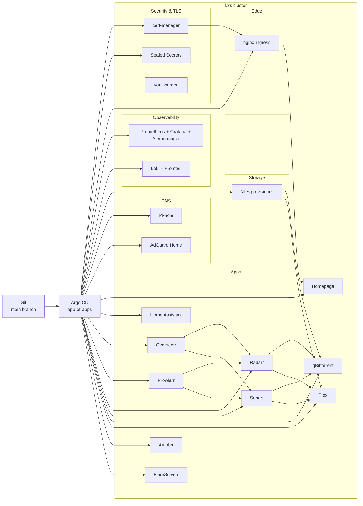

# Homelab · Kubernetes · GitOps

**Personal cluster, production-style habits:** everything lives in Git, Argo CD reconciles it, and the stack is observable end-to-end.  
Ansible for the metal, Helm for workloads, Sealed Secrets for anything sensitive.

---

### How it fits together

---

### Why open this repo (10-second scan)

| You’re looking for… | It’s here |
|---------------------|-----------|
| GitOps | Argo CD app-of-apps, sync waves, Image Updater on selected charts |
| IaC | Ansible roles for k3s node + Helm charts for every workload |
| Observability | kube-prometheus-stack, Loki/Promtail, custom alert rules |
| Security posture | Sealed Secrets, ingress TLS, Ansible ssh/UFW/fail2ban baseline |
| Real homelab problems | NFS, hostNetwork where discovery requires it, `*.home` DNS patterns |

---

### Repo layout

- **Root app:** `argocd-apps/app-of-apps.yaml`
- **Applications:** `argocd-apps/apps/`, `argocd-apps/infrastructure/`
- **Charts:** `apps/` (workloads), `infrastructure/` (platform add-ons)
- **Optional / not in Argo yet:** `infrastructure/velero/` (backups when you wire object storage)
- **Legacy:** `legacy/docker-compose.yml` — compose stack **before** k8s; reference only

### Docs

- [docs/setup.md](docs/setup.md) — Ansible, bootstrap, secrets, DNS  
- [docs/architecture.md](docs/architecture.md) — topology, namespaces, ingress table, sync waves, security detail  
